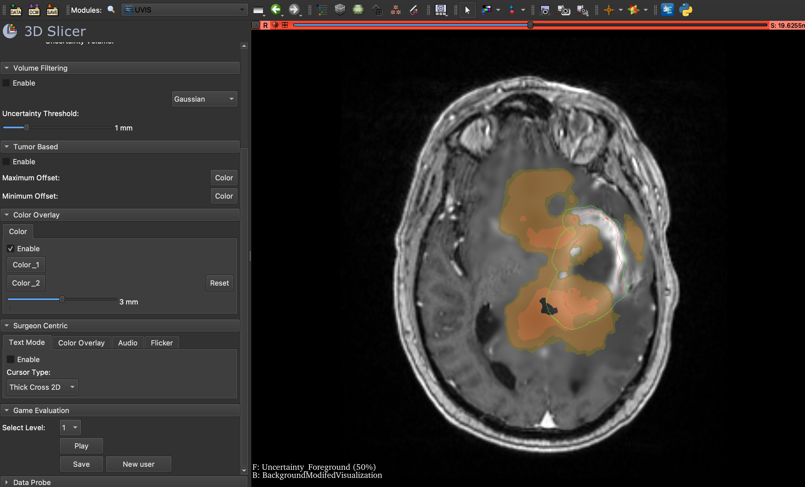

# Welcome to Uncertainty Visualization Tool 👋

Interactive Platform for Visualizing Uncertainty in MRI Images in 3D slicer



With Uncertainty Visualization Tool  you can visualize uncertainty in medical images, helping during tumor resection surgeries. The tool offers four main features: Volume Filtering, Color Overlay, Surgeon-Centric, and Tumor-Based visualizations. Additionally, evaluate each technique through an interactive game designed to identify the most effective visualization.

## Features

- **Volume Filtering:** Filter volume data to highlight areas of interest.
- **Color Overlay:** Apply color overlays to visualize different uncertainty levels.
- **Surgeon-Centric:** Focus on the surgeon's perspective for critical decision-making.
- **Tumor-Based:** Tailor visualizations based on tumor characteristics.

## Installation
Follow these steps to deploy UncertaintyViz X in your local environment.

### Prerequisites 🧰

Install [3D Slicer](https://www.slicer.org/) from https://www.slicer.org/.

### 🟢 Deploy
Clone the repository and install dependencies:
```shell
git clone https://github.com/mahsageshvadi/UncertaintyVisualization.git
cd UncertaintyVisualization

### How to get started

1. **Install dependencies:**
   pip install -r requirements.txt

2. **Prepare your data:**
   - Uncertainty array representing estimated uncertainty volume in millimeters.
   - MRI image for overlay visualization.

3. **For evaluation:**
   - Ground truth MRI image.
   - Modified MRI image.


