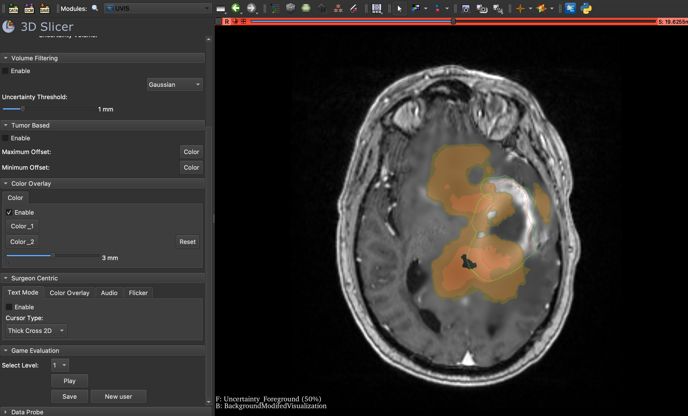
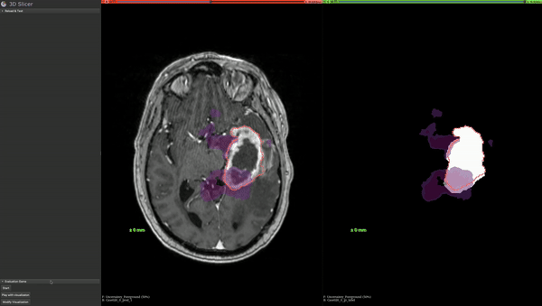
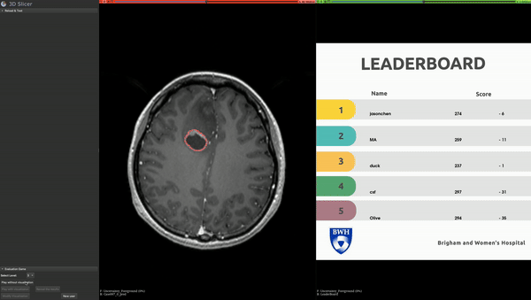
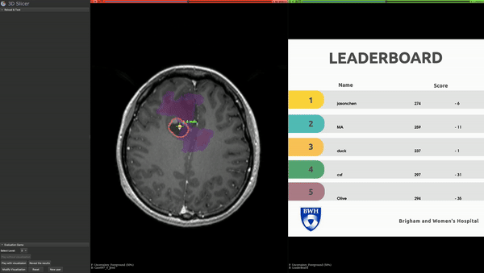

# UVisExplore: Uncertainty Visualization Tool for Tumor Resection Surgery



UVisExplore is a comprehensive uncertainty visualization software designed to assist neurosurgeons during brain tumor resection surgeries. The tool enables both qualitative and quantitative exploration of various uncertainty visualization methods, focusing on enhancing decision-making while minimizing the cognitive load in the complex surgical environment.

## Challenges in Brain Surgery

One of the significant challenges during brain tumor resection is brain shift—the dynamic and non-rigid deformation of the brain caused by various factors such as head position, fluid levels, and tissue resection. Brain shift can invalidate the alignment between preoperative images and the patient's brain during surgery, introducing uncertainty into the surgical process. UVisExplore addresses these challenges by providing advanced visualization techniques that help surgeons understand and manage this uncertainty, ensuring safer and more effective surgeries.

## Features

* **Color Overlay:** Surgeons can adjust color maps to indicate different levels of registration uncertainty. For example, orange may indicate high uncertainty, while green indicates low uncertainty.
* **Surgeon-Centric Visualization:** Focuses on uncertainty visualization at the tip of the surgical instrument. Modes include:
  * **Audio Warning:** Alerts when entering/exiting high-uncertainty regions.
  * **Flicker mode:** The image flickers when the instrument moves into unsafe regions.
  * **Text Overlay:** Displays uncertainty values in millimeters  directly at the instrument tip.
  * **Localized Color Map:** Visualizes uncertainty using a color map only around the surgical instrument's tip.
* **Tumor-Based Visualization:** Visualizes the uncertainty at the tumor boundary using minimum and maximum offset volumes to indicate the possible extent of the tumor.
* **Uncertainty-Based Image Filtering:**  MRI images are blurred, or noise is introduced in regions with high uncertainty, allowing surgeons to visually interpret the reliability of different image areas.

## Game for Training and Evaluation

Surgery requires careful evaluation of new tools. To support this, UVisExplore includes a game-based approach that serves as both a training tool and a decision-making simulation.

### Game Structure

The game has two levels:
* **Training Level:** Players can see the ground truth while performing tumor resections, helping them learn how uncertainty visualization affects outcomes.
  
  
  
* **Challenge Level:**
  * **Step 1: Without Visualization:** Players resect the tumor without any visualization, establishing a baseline.
    
    
  
  * **Step 2: With Visualization:** Players repeat the task with uncertainty visualization to compare effectiveness and see the results of their decisions.
    
    

## Installation

Follow these steps to deploy this tool  in your local environment.

### Prerequisites 

Install [3D Slicer](https://www.slicer.org/) from [slicer.org](https://www.slicer.org/).

### Deploy

Clone the repository and install dependencies:
```bash
git clone https://github.com/mahsageshvadi/UncertaintyVisualization.git
cd UncertaintyVisualization
```

### How to get started

1. **Install dependencies:**
   pip install -r requirements.txt

2. **Prepare your data:**
   - Uncertainty array representing estimated uncertainty volume in millimeters.
   - MRI image for overlay visualization.

3. **For evaluation:**
   - Ground truth MRI image.
   - Modified MRI image.

### License
This project is licensed under the MIT License.

### Contact
For more information or to contribute, please contact Mahsa Geshvadi at mgeshvadi@gmail.com
